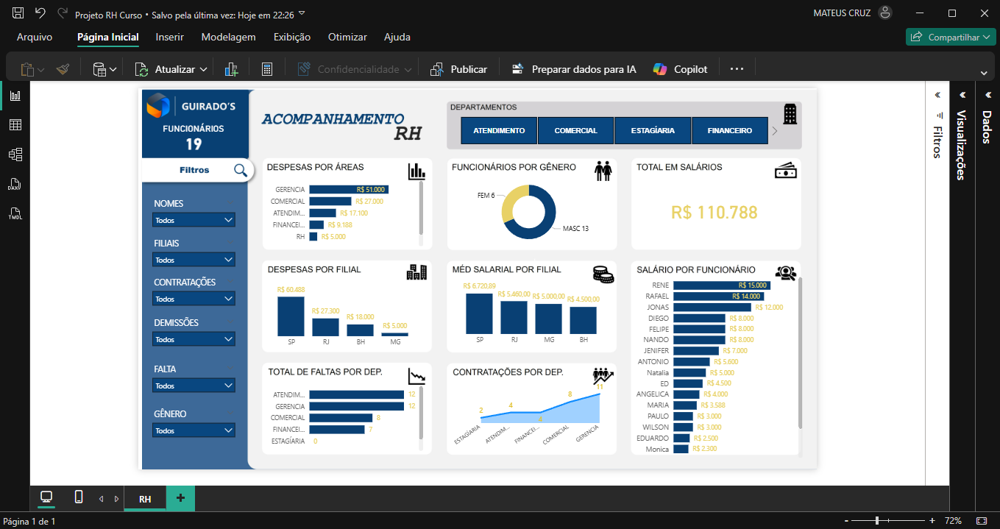

# Dashboard-RH-PowerBI
Dashboard de RH desenvolvido em Power BI com modelagem de dados, Power Query e medidas em DAX para análise de funcionários, contratações, desligamentos e turnover. O projeto entrega visualizações interativas e indicadores gerenciais voltados à tomada de decisão.

## Objetivo do Dashboard
Identificar o maior número de faltas, o maior gasto entre as filiais e a soma dos salários para visualização clara na quantidade de gastos.

## Principais Indicadores

- Total de Faltas
- Faltas por Departamento
- Média de Gastos por Filial (salário)
- Salário por Funcionário
- Total de Despesas por Área

## Imagem Dashboard

## Insights
A área de Gerência apresentou o maior volume de despesas salariais e também uma das maiores quantidades de faltas registradas, indicando uma oportunidade para investigação mais detalhada dos fatores que impactam a eficiência operacional do setor.

## Tecnologias Utilizadas

- Microsoft Power BI
- Power Query
- DAX
- Modelagem de Dados
- Segmentações de Dados
- Visualizações Interativas

## Arquivos
- ProjetoDashboardRH.pbix
- Base_Excel.xlsx
